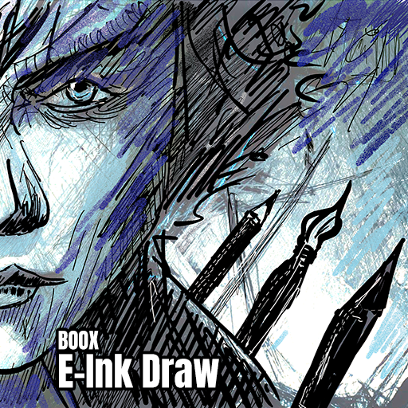

# Boox E-Ink Draw

Minimal but fast Android drawing app focused on Onyx Boox e-ink devices, with priority on low stylus latency and stable stroke replay.



## Download and installation
Fetch the APK from the [releases](https://github.com/steffest/Boox-EinkDraw/releases/) page and isntall it on your Boox device.


## What is this?

This project is a Boox-specific drawing app that combines:

- Hardware pen preview (near-zero latency on e-ink)
- Software canvas rendering (persistent bitmap/export/load)

Current app includes:

- Brush selector (exposing all hardware brush types found in their SDK)
- Brush-width slider
- Color swatches and color picker
- Layer panel to manage layers
- Full-screen drawing surface
- Basic pinch zooming/panning

## For what tablet?

Primary target and test device:

- **Onyx Boox Note Air4C** (Android 13)

This app was made to scratch a personal itch.  
It probably can run on other Onyx Boox tablets that expose the same Onyx pen APIs, but behavior can vary by firmware/device generation.  
(so it's very much a "it works on my device" project)

## Hardware brushes available

From `HardwarePenStyle`:

- `PENCIL` (default width `5px`)
- `FOUNTAIN` (`8px`)
- `MARKER` (`20px`)
- `NEO_BRUSH` (`12px`)
- `CHARCOAL` (`10px`)
- `DASH` (`5px`)
- `CHARCOAL_V2` (`10px`)
- `SQUARE_PEN` (`8px`)

These map to Onyx hardware stroke-style IDs used by `TouchHelper`.

## File format
Next to PNG, this app loads and saves the [Dpaint.js](https://dpaint.app/) format.  
Dpaint.js is my fully featured pixel drawing app. Dpaint.js works fine on the Boox tablet (install as chrome app recomended) - but as all generic 3rth party drawing apps, it is quite slow on the Boox tablet because it doesn't use the device specific hardware brushes.   
This app was created to fill that gap.  
The Dpaint.js file format supports layers and all other features found in this app.  

## Onyx SDK

the Onyx Eink devices deliver a native zero-latency drawing experience. 
This is achieved by using a hardware-driven pen experience: during drawing, the "Android screen" gets frozen and there is a direct communication line to the display controller, updating the screen with a pre-defined set of system brushes. 
These strokes are then synced with the software app canvas.

Onyx SDK documentation is sparse, missing or outdated. 
API behavior is partially firmware-dependent.  
 
this is is a call-out to Onyx to show there are developer out there that want to develop for your devices. Your low-latency Eink drawing libraries deliver a best-in-class drawing experience.  
But .... for peeps sake .... you make it VERY hard for developers to find the correct documentation needed to use these in their own apps.  
Please update your documentation and put out some recent code examples.

This app uses Onyx pen/e-ink APIs from:

- `onyxsdk-base`
- `onyxsdk-device`
- `onyxsdk-pen`

It also bundles missing native-pen Java classes used by wrappers:

- `app/libs/onyxsdk-pen-native-classes.jar`

However ... these classes contain wrappers to functions that reside in `libneo_pen.so` - this a system library that only system apps can access.
(so 3rth party apps can't use them directly)

In this project, a copy of this library is included.  
As this is a system-level library, it's device and firmware dependant, so it may very wall fail on your device.

## Hardware-enabled drawing approach (zero-latency)

Core idea: let the hardware path draw immediately, while software reconstruction happens in parallel.

1. `TouchHelper` is created with `FEATURE_ALL_TOUCH_RENDER`.
2. On brush/width/color changes, hardware is configured in strict order:
   - width
   - color
   - limit rect
   - `openRawDrawing()`
   - style
   - reapply width/color (some styles reset these internally)
   - `setRawDrawingRenderEnabled(false)` for hardware preview
   - enable/disable raw input based on UI suppression state
3. During pen movement, `RawInputCallback` receives points.
4. On pen-up, points are rendered into a software bitmap (`OnyxStrokeRenderer`).
5. Hardware preview clears, software bitmap is shown, then e-ink refresh is triggered.

This gives low perceived latency while still producing a persistent/exportable canvas.


## Moving from hardware preview to software canvas

This is the critical handoff path:

1. Hardware preview draws live stroke immediately.
2. Callback streams are collected:
   - authority list stream (`onRawDrawingTouchPointListReceived`)
   - raw move stream (`onRawDrawingTouchPointMoveReceived`)
3. On pen-up:
   - app selects the best point source (especially for charcoal where one stream can lose tilt/pressure fidelity)
   - stroke is rendered into software canvas with matching brush renderer
   - snapshot is updated for fast rebuild/clear/load paths
4. `onPenUpRefresh` (or fallback timer) invalidates view so software result replaces hardware preview cleanly.

Implementation anchors:

- hardware bridge + callback orchestration: `HardwarePenSurfaceView`
- per-brush software renderer: `OnyxStrokeRenderer`

## Build requirements

- Android Gradle Plugin: `8.6.1`
- Kotlin plugin: `1.9.25`
- Compile SDK / Target SDK: `34`
- Min SDK: `26`
- Java/Kotlin target: `17`

## Build

### Android Studio

1. Open the project folder.
2. Let Gradle sync.
3. Connect Boox device (ADB USB or wireless).
4. Run `app` on device.

### Command line

```bash
./gradlew :app:assembleDebug
adb install -r app/build/outputs/apk/debug/app-debug.apk
```


## Known missing features / shortcomings:

- Zooming is supported, but when zoomed-in, the direct mapping between hardware enabled system brushes and the software canvas falls apart very quickly. This means that the zero-latency hardware preview of the stroke won't match the end result on the canvas all that well when drawing on a zoomed in canvas.
- undo/redo is not there yet (just think of it like real paper :-)

It is not my goal to build a fully features drawing app for android.
(I have [dpaint.js](https://github.com/steffest/DPaint-js) for that - which works fine on Android tablets as installed Chrome app.)  
This project might be useful for other devs as example how to use the Boox hardware brushes in your own app.

